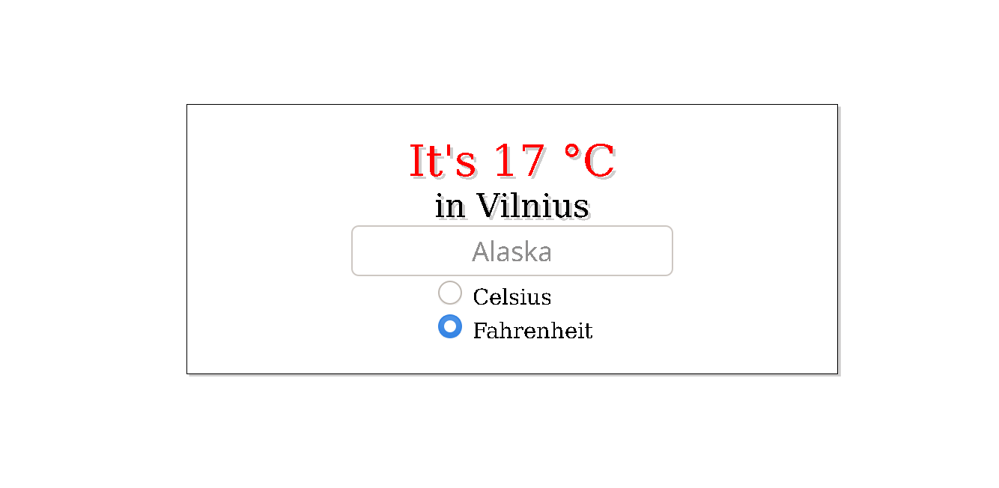

# Weather App



I built a weather application, with basic styling, using JavaScript openweathermap.org and API. Visitor is able to input the name of the city and instantly get weather information for procided location.

## Built With

- JavaScript
- API
- HTML/CSS

## Getting Started

To get a local copy of the repository please run the following commands on your terminal:

```
$ cd <folder>
```

```
$ git clone https://github.com/zilton7/weather-app.git
```

```
$ cd weather-app
```

```
$ npm install
```
### Prerequisites

Free account for openweathermap.org 

- Visit https://openweathermap.org/

- Create a free account!

- Copy the API-key which you can find in your email or account.

- Change the API in src/index.js on line 1.

- To use the app simply enter the name of your city and click on search.

## AUTHOR

**ZIL NORVILIS**

- Github: [](https://github.com/zilton7)
- Linkedin: [](https://www.linkedin.com/in/zil-norvilis/)
- Twitter: [](https://twitter.com/devnor7)


## Show your support

Give a ⭐️ if you like this project!

## Acknowledgments

- Hat tip to anyone whose code was used.
- Inspiration
- etc
